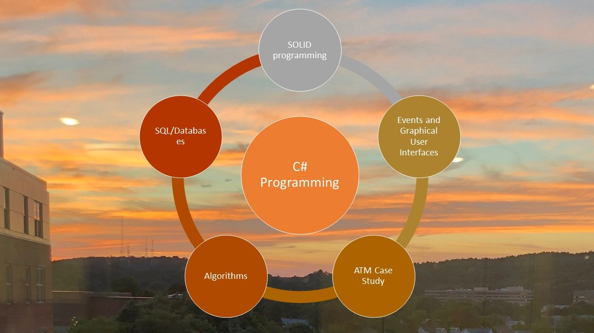

# Object Oriented Programming CSharp

The project provides on overview on object oriented programming in C sharp
#### reference Deitel how to program C#

All images are custom or have a reference name

## Programming Skills

## Events 

## Object oriented programming in C#

### MS Visual Studio.NET

## Algorithms and Programming

## Ethics and Integrity

Advanced details:  https://github.com/alpaddesai/SoftwareEngineering
