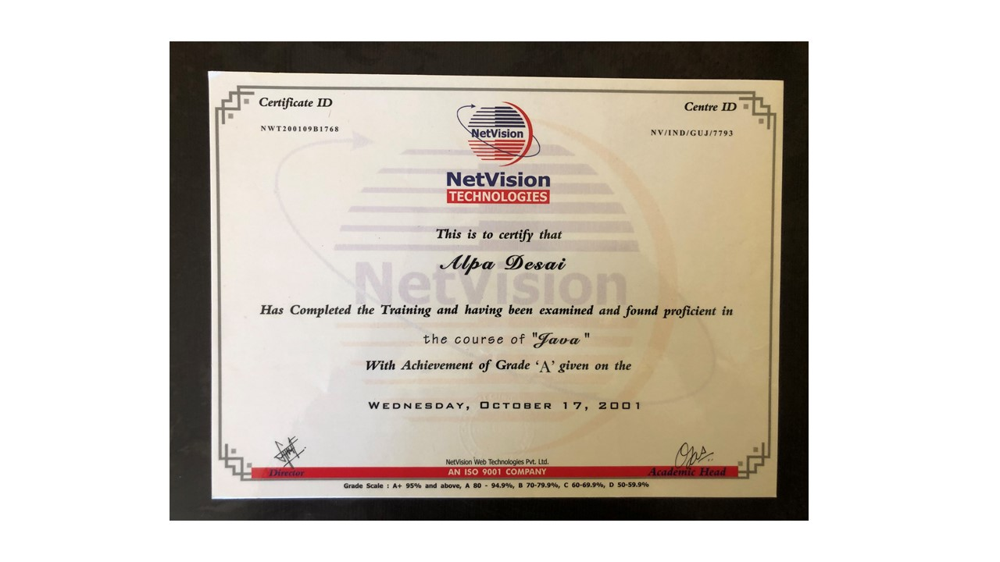
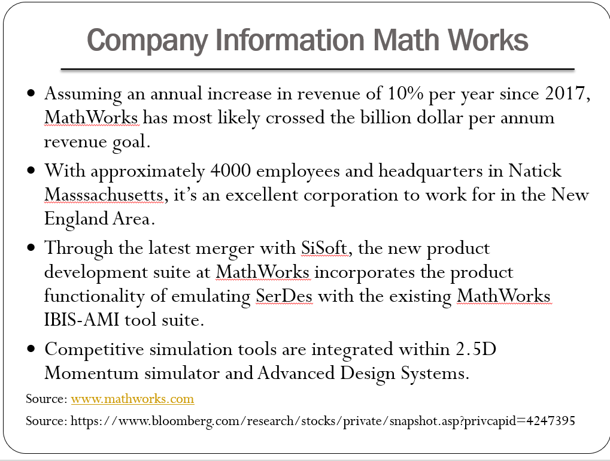

# Object Oriented Programming CSharp

The project provides on overview on object oriented programming in C sharp

Please click on the executable located in https://github.com/alpaddesai/ObjectOrientedProgrammingCSharp/releases for details.

For details reference: https://github.com/alpaddesai/ATMRegressionTestSuite. Reference "How to program with Deitel C#"

All images are custom or have a reference name

## Databases

## Events 

## Object oriented programming in C#
### MS Visual Studio.NET

## Object oriented programming

## Ethics and Integrity

## Interest

Advanced details:  https://github.com/alpaddesai/DatabaseManagementDesign
